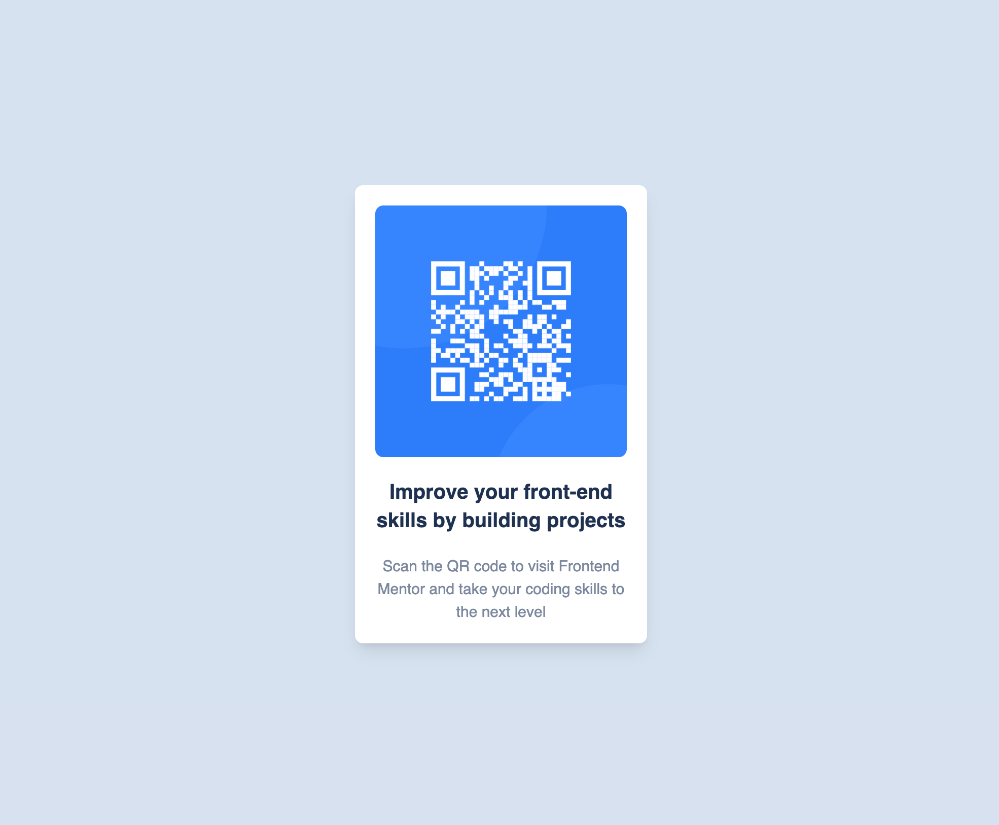

# Frontend Mentor - QR code component solution

This is a solution to the [QR code component challenge on Frontend Mentor](https://www.frontendmentor.io/challenges/qr-code-component-iux_sIO_H). Frontend Mentor challenges help you improve your coding skills by building realistic projects.

## Table of contents

- [Overview](#overview)
  - [Screenshot](#screenshot)
  - [Links](#links)
- [My process](#my-process)
  - [Built with](#built-with)
  - [What I learned](#what-i-learned)
  - [Continued development](#continued-development)
  - [Useful resources](#useful-resources)
- [Author](#author)
- [Acknowledgments](#acknowledgments)

## Overview

### Screenshot

### Links

- Solution URL: [Github](https://github.com/dipto0321/qr_code_component)
- Live Site URL: [Live site](https://bespoke-praline-439fae.netlify.app/)

## My process

### Built with

- Semantic HTML5 markup
- Mobile-first workflow
- [React](https://reactjs.org/) - JS library
- [TailwindCSS](https://tailwindcss.com/) - For styles

### What I learned

Building this project I learned flex with basic HTML 5 feature with React and tailwindCSS

## Author

- LinkedIn - [Dipto Karmakar](https://www.linkedin.com/in/diptokarmakar)
- Frontend Mentor - [@dipto0321](https://www.frontendmentor.io/profile/dipto0321)
- Twitter - [@imdiptokmk](https://www.twitter.com/imdiptokmk)
